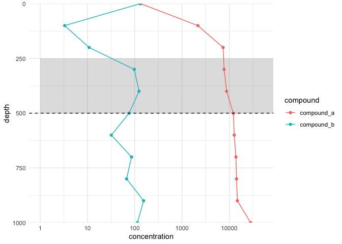
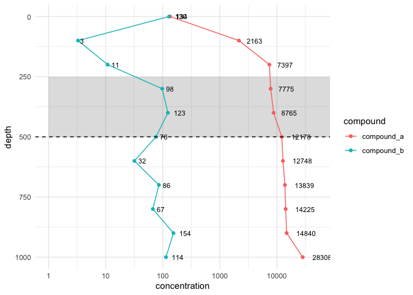
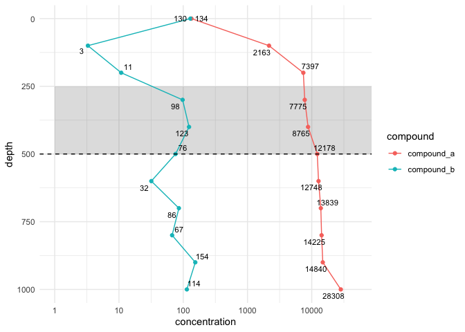
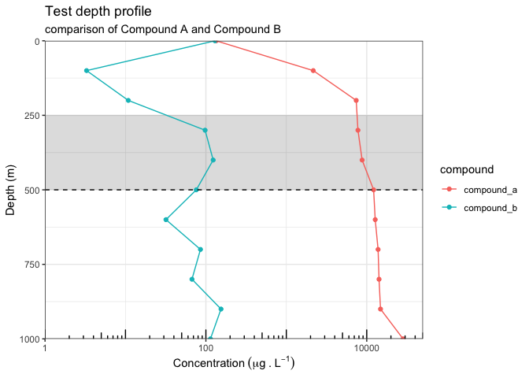
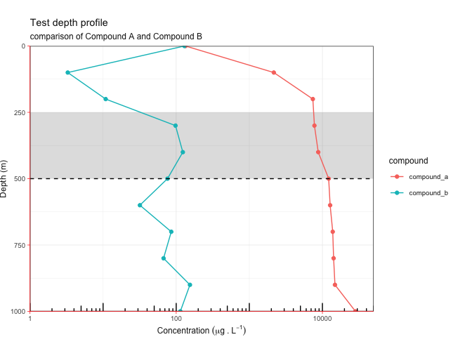
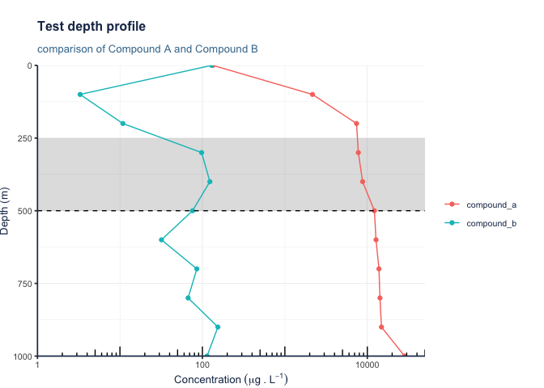
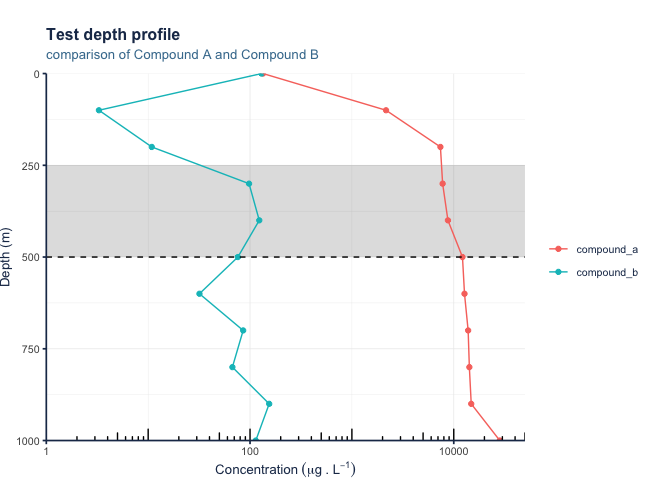
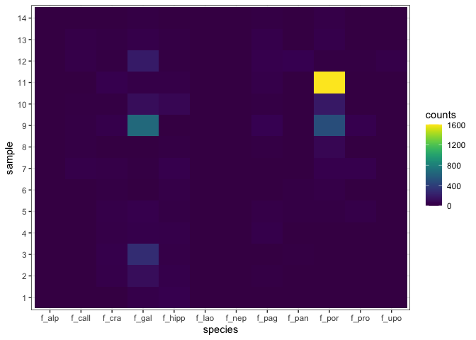
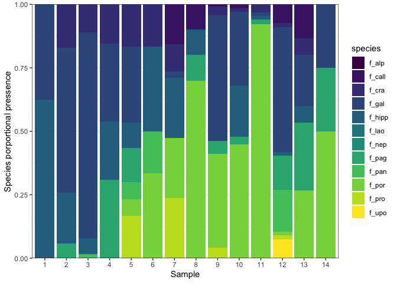
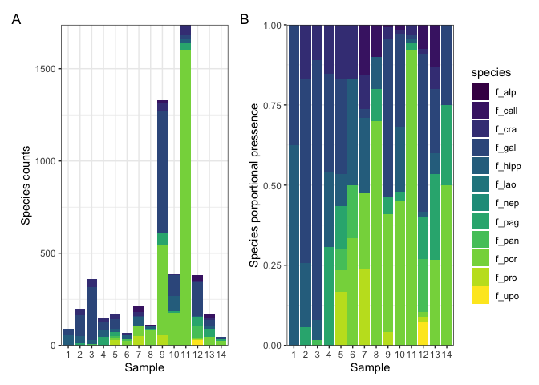

# Adding a shaded area (contd from last week)

First we create the moc depth profile data we were using. By setting the same seed as last week, we make sure that our "random" data is exactly the same as last week


```r
set.seed(1111)

depth_data <- tibble(depth = seq(0,1000, by = 100),
                     compound_a = sort(abs(rnorm(11, 1000, 10000))),
                     compound_b = abs(rnorm(11, 80, 50)))
```


There were two main issues:

- The x axis was logged, it cannot seem to be able to plot to -Inf in a log scale (doesnt seem to have issues with the +Inf... )
- `geom_rect()` was ploting multiple copies of the rectangle

In order to solve the first one, we can just set the lower limit to a low number within our plot, it is not ideal, but it works

The second issue is a bit more complicated. `geom_rect()` required a dataset (like most geoms). By default it is using the one that is coming down the pipe, whihc is applie dto the whole plot. That results in an unexpected behaviour where it plots one full rectangle for each datapoint in the main dataset (even though that data is not used based on what we are imputing in the `aes()`). This is not great, because as the rectangles pverlap, they get darker (thats how i figured out what was happening!). It also does make a separate layer addition for each, so when exposrted as a pdf, or eps or svg, it woul result in a big and "chuggy" file. In order to solve that, there are a couple of options.

- we can create a small dataset within the geom, and then call these items in the aes(), but it is a bit complex
- if the purpuse is just to annotate the plot, and our rectangle doesnt require information from the dataset, we can just the `anotate()` ggplot element and add a rectangle that way. Annotations don't require a dataset, so it doesn't suffer from that behaviour.


```r
depth_data %>% 
  pivot_longer(cols = -depth, 
               names_to = "compound", 
               values_to = "concentration") %>% 
  
  #main plotting elements
  ggplot() +
  
  # geom_rect(aes(ymin = 250, ymax = 500, xmin = 1, xmax = Inf),  alpha = 0.2) +  # plots multiple copies, noooo good.

  # geom_rect(data = tibble(ymin = 250, ymax = 500, xmin = 1, xmax = Inf),
  #           aes(ymin = ymin, ymax = ymax, xmin = xmin, xmax = xmax),  alpha = 0.2) +  # need to give it a dataframe
  
  annotate(geom = "rect", 
           ymin = 250, ymax = 500, xmin = 1, xmax = Inf,
           alpha = 0.2) +  # Probably the easiest aproach when annotating is the goal
  
  
  geom_point(aes(x = concentration, y = depth, colour = compound)) +
  geom_path(aes(x = concentration, y = depth, colour = compound)) +
  geom_hline(aes(yintercept = 500), linetype = "dashed") +

  #scales
  scale_y_reverse(expand = expansion(mult = 0, add = 0)) +
  scale_x_log10(limits = c(1, 50000)) +
  
  # themes
  
  theme_minimal()
```

<!-- -->

## One final line we had not seen

We had missed the `geom_abline()` which allow us to create a line between two points (hence the A B Line), or to provide an intercept and a slope to plot a line. Very usefult to set a 1:1 line for something like a QQ-Plot


```r
tibble(x = seq(from = 1, to = 10, by = 1),
       y = seq(from = 1, to = 10, by = 1)) %>% 
ggplot() +
  geom_point(aes(x = x, y = y)) +
  geom_abline(aes(intercept = 0, slope = 1)) +
  geom_abline(aes(intercept = 2, slope = 0.5), linetype = "dashed") +
  
  theme_bw()
```

-1.png)<!-- -->

# Annotations

The issue with `geom_rect()` last week is the perfect segway into diferent ways of creating anotations.


```r
depth_data %>% 
  pivot_longer(cols = -depth, 
               names_to = "compound", 
               values_to = "concentration") %>% 
  
  #main plotting elements
  ggplot() +
  
  annotate(geom = "rect", 
           ymin = 250, ymax = 500, xmin = 1, xmax = Inf,
           alpha = 0.2) +  # Probably the easiest aproach when annotating is the goal
  
  annotate(geom = "text",
           x = 1, y = 500,
           label = "Reference level",
           hjust = -0.1,
           vjust = -0.5) +
  
    annotate(geom = "label",
           x = 5000, y = 100,
           label = "Important point",
           hjust = -0.1,
           vjust = -0.5) +
  
  annotate(geom = "curve",
           x = 25000, y = 100, xend = 10000, yend = 200,
           arrow = arrow(length = unit(2, "mm")),
           curvature = -0.5) +
  
  
  geom_point(aes(x = concentration, y = depth, colour = compound)) +
  geom_path(aes(x = concentration, y = depth, colour = compound)) +
  geom_hline(aes(yintercept = 500), linetype = "dashed") +

  #scales
  scale_y_reverse(expand = expansion(mult = 0, add = 0)) +
  scale_x_log10(limits = c(1, 50000)) +
  
  # themes
  
  theme_minimal()
```

<!-- -->
but what if i wanted to provide all the values???

Now the actual `geom_text()` comes handy, because we actually need to map labels to data


```r
depth_data %>% 
  pivot_longer(cols = -depth, 
               names_to = "compound", 
               values_to = "concentration") %>% 
  
  #main plotting elements
  ggplot() +
  
  annotate(geom = "rect", 
           ymin = 250, ymax = 500, xmin = 1, xmax = Inf,
           alpha = 0.2) +  # Probably the easiest aproach when annotating is the goal
  
  geom_point(aes(x = concentration, y = depth, colour = compound)) +
  geom_path(aes(x = concentration, y = depth, colour = compound)) +
  geom_hline(aes(yintercept = 500), linetype = "dashed") +
  
  geom_text(aes(x = concentration, 
                y = depth, 
                label = round(concentration)),
            hjust = -0.5, 
            size = 3) +

  #scales
  scale_y_reverse() +
  scale_x_log10(limits = c(1, 50000)) +
  
  # themes
  
  theme_minimal()
```

<!-- -->
Unfortunatelly the labels overlap. the package `{ggrepel}` can help with that!


```r
depth_data %>% 
  pivot_longer(cols = -depth, 
               names_to = "compound", 
               values_to = "concentration") %>% 
  
  #main plotting elements
  ggplot() +
  
  annotate(geom = "rect", 
           ymin = 250, ymax = 500, xmin = 1, xmax = Inf,
           alpha = 0.2) +  # Probably the easiest aproach when annotating is the goal
  
  geom_point(aes(x = concentration, y = depth, colour = compound)) +
  geom_path(aes(x = concentration, y = depth, colour = compound)) +
  geom_hline(aes(yintercept = 500), linetype = "dashed") +
  
  geom_text_repel(aes(x = concentration, 
                y = depth, 
                label = round(concentration)), 
            size = 3) +

  #scales
  scale_y_reverse() +
  scale_x_log10(limits = c(1, 50000)) +
  
  # themes
  
  theme_minimal()
```

<!-- -->
# Commong formating options

The x axis is in log scale. The log scale is not evenly spaced, so lets make sure we show that with some tick marks

In this one we are going to also edit the title, subtitle, and the lables of the x and y axis.


```r
depth_data %>% 
  pivot_longer(cols = -depth, 
               names_to = "compound", 
               values_to = "concentration") %>% 
  
  #main plotting elements
  ggplot() +
  
  annotate(geom = "rect", 
           ymin = 250, ymax = 500, xmin = 1, xmax = Inf,
           alpha = 0.2) +  # Probably the easiest aproach when annotating is the goal
  
  
  geom_point(aes(x = concentration, y = depth, colour = compound)) +
  geom_path(aes(x = concentration, y = depth, colour = compound)) +
  geom_hline(aes(yintercept = 500), linetype = "dashed") +

  #scales
  scale_y_reverse(expand = expansion(mult = 0, add = 0)) +
  scale_x_log10(limits = c(1, 50000), expand = expansion(mult = 0, add = 0)) +
  
  annotation_logticks(sides = "b") + # adds log-spaced tick marks
  
  # theme and other formatting
  
  theme_bw() +
  
  labs(title = "Test depth profile",
       subtitle = "comparison of Compound A and Compound B",
       x = "Concentration (mg/L)",
       y = "Depth (m)")
```

<!-- -->

But what if the concentration was in $\mu$g/L (more info on how to include greek symbols in ggplots [here](https://github.com/tidyverse/ggplot2/wiki/Plotmath))


```r
depth_data %>% 
  pivot_longer(cols = -depth, 
               names_to = "compound", 
               values_to = "concentration") %>% 
  
  #main plotting elements
  ggplot() +
  
  annotate(geom = "rect", 
           ymin = 250, ymax = 500, xmin = 1, xmax = Inf,
           alpha = 0.2) +  # Probably the easiest aproach when annotating is the goal
  
  
  geom_point(aes(x = concentration, y = depth, colour = compound)) +
  geom_path(aes(x = concentration, y = depth, colour = compound)) +
  geom_hline(aes(yintercept = 500), linetype = "dashed") +

  #scales
  scale_y_reverse(expand = expansion(mult = 0, add = 0)) +
  scale_x_log10(limits = c(1, 50000), expand = expansion(mult = 0, add = 0)) +
  
  annotation_logticks(sides = "b") + # adds log-spaced tick marks
  
  # theme and other formatting
  
  theme_bw() +
  
  labs(title = "Test depth profile",
       subtitle = "comparison of Compound A and Compound B",
       x = expression(Concentration~(mu*g~.~L^{-1})),  # with expression() you can plot math. "~" means a space
       y = "Depth (m)")
```

<!-- -->
Let's change now some of theme elements


```r
depth_data %>% 
  pivot_longer(cols = -depth, 
               names_to = "compound", 
               values_to = "concentration") %>% 
  
  #main plotting elements
  ggplot() +
  
  annotate(geom = "rect", 
           ymin = 250, ymax = 500, xmin = 1, xmax = Inf,
           alpha = 0.2) +  # Probably the easiest aproach when annotating is the goal
  
  
  geom_point(aes(x = concentration, y = depth, colour = compound)) +
  geom_path(aes(x = concentration, y = depth, colour = compound)) +
  geom_hline(aes(yintercept = 500), linetype = "dashed") +

  #scales
  scale_y_reverse(expand = expansion(mult = 0, add = 0)) +
  scale_x_log10(limits = c(1, 50000), expand = expansion(mult = 0, add = 0)) +
  
  annotation_logticks(sides = "b") + # adds log-spaced tick marks
  
  # theme and other formatting
  
  theme_bw() +
  
  labs(title = "Test depth profile",
       subtitle = "comparison of Compound A and Compound B",
       x = expression(Concentration~(mu*g~.~L^{-1})),  # with expression() you can plot math. "~" means a space
       y = "Depth (m)") +
  
  theme(text = element_text(size = 9, colour = 'grey10'),
        line = element_line(size = 0.25),
        axis.line = element_line(size = 0.25, colour = "red"),
        axis.ticks = element_line(size = 0.25, colour = "red"),
        plot.margin = unit(c(0.7,0.7,0,0), "cm" ))
```

<!-- -->


Now, let's move the legend around


```r
depth_data %>% 
  pivot_longer(cols = -depth, 
               names_to = "compound", 
               values_to = "concentration") %>% 
  
  #main plotting elements
  ggplot() +
  
  annotate(geom = "rect", 
           ymin = 250, ymax = 500, xmin = 1, xmax = Inf,
           alpha = 0.2) +  # Probably the easiest aproach when annotating is the goal
  
  
  geom_point(aes(x = concentration, y = depth, colour = compound)) +
  geom_path(aes(x = concentration, y = depth, colour = compound)) +
  geom_hline(aes(yintercept = 500), linetype = "dashed") +

  #scales
  scale_y_reverse(expand = expansion(mult = 0, add = 0)) +
  scale_x_log10(limits = c(1, 50000), expand = expansion(mult = 0, add = 0)) +
  
  annotation_logticks(sides = "b") + # adds log-spaced tick marks
  
  # theme and other formatting
  
  theme_bw() +
  
  labs(title = "Test depth profile",
       subtitle = "comparison of Compound A and Compound B",
       x = expression(Concentration~(mu*g~.~L^{-1})),  # with expression() you can plot math. "~" means a space
       y = "Depth (m)") +
  
  theme(text = element_text(size = 9, colour = 'grey10'),
        line = element_line(size = 0.25),
        axis.line = element_line(size = 0.25, colour = "red"),
        axis.ticks = element_line(size = 0.25, colour = "red"),
        plot.margin = unit(c(0.7,0.7,0,0), "cm" )) +
  
  theme(legend.position = "bottom")
```

<!-- -->


```r
depth_data %>% 
  pivot_longer(cols = -depth, 
               names_to = "compound", 
               values_to = "concentration") %>% 
  
  #main plotting elements
  ggplot() +
  
  annotate(geom = "rect", 
           ymin = 250, ymax = 500, xmin = 1, xmax = Inf,
           alpha = 0.2) +  # Probably the easiest aproach when annotating is the goal
  
  
  geom_point(aes(x = concentration, y = depth, colour = compound)) +
  geom_path(aes(x = concentration, y = depth, colour = compound)) +
  geom_hline(aes(yintercept = 500), linetype = "dashed") +

  #scales
  scale_y_reverse(expand = expansion(mult = 0, add = 0)) +
  scale_x_log10(limits = c(1, 50000), expand = expansion(mult = 0, add = 0)) +
  
  annotation_logticks(sides = "b") + # adds log-spaced tick marks
  
  # theme and other formatting
  
  theme_bw() +
  
  labs(title = "Test depth profile",
       subtitle = "comparison of Compound A and Compound B",
       x = expression(Concentration~(mu*g~.~L^{-1})),  # with expression() you can plot math. "~" means a space
       y = "Depth (m)") +
  
  theme(text = element_text(size = 9, colour = 'grey10'),
        line = element_line(size = 0.25),
        axis.line = element_line(size = 0.25, colour = "red"),
        axis.ticks = element_line(size = 0.25, colour = "red"),
        plot.margin = unit(c(0.7,0.7,0,0), "cm" )) +
  
  theme(legend.position = "bottom",
        legend.title = element_blank(),
        legend.direction = "vertical")
```

<!-- -->


## Custom themes in ggplot

This section is highly inspired by [this post](https://rpubs.com/mclaire19/ggplot2-custom-themes)


```r
theme_pepe <-  theme(
  
  text = element_text(          # Set up the default for ALL text elements (unless they are over-written in theme_bw())
    size = 10,                  # set up size
    colour = '#1d3557'),         # Set up colour (hex number)
  
  line = element_line(          # set up the default for ALL lines (unless they are over-written in theme_bw())
    size = 0.25,                # Set line thickness
    colour = '#1d3557'),        # Set line colour (hex number)
  
  plot.title = element_text(    # specific details for plot title
    hjust = 0,                  # Make sure it is left-aligned
    size = 12,                  # We make it a bit bigger than the default
    face = 'bold'),       
  
  plot.subtitle = element_text(    # specific details for plot title
    hjust = 0,                     # Make sure it is left-aligned
    colour = '#457b9d',            # Set colour (hex number)
    margin = margin(5,0,10,0)),    # add a bit of margin top and bottom to separate from title and plot
  # margins are specified as top, right, bottom and left
  
  # Remove backgrounds      
  
  plot.background = element_blank(),    # remove the background for the whole plotting area
  
  panel.background = element_blank(),   # remove the background for the plot itself
  
  panel.border = element_blank(),       # remove the border of the plot
  
  # Work the axis a bit
  
  axis.line = element_line(             # details specific for axis
    size = 0.6),
  
  axis.ticks = element_line(            # Details specific to axis ticks
    size = 0.6),
  
  # A few changes on legends 
  # you dont want to "hardcode" too much on legends as these are very plot-speciffic
  
  legend.title = element_blank(),            # remove legend title
  legend.background = element_blank(),       # remove background on legend itself
  legend.box.background = element_blank(),   # remove background on legend box
  
  # margin around the plot
  
  plot.margin = unit(c(0.7,0.7,0,0), "cm" )  # margin around the plot (top, right, bottom, left)
)
```


```r
depth_data %>% 
  pivot_longer(cols = -depth, 
               names_to = "compound", 
               values_to = "concentration") %>% 
  
  #main plotting elements
  ggplot() +
  
  annotate(geom = "rect", 
           ymin = 250, ymax = 500, xmin = 1, xmax = Inf,
           alpha = 0.2) +  # Probably the easiest aproach when annotating is the goal
  
  
  geom_point(aes(x = concentration, y = depth, colour = compound)) +
  geom_path(aes(x = concentration, y = depth, colour = compound)) +
  geom_hline(aes(yintercept = 500), linetype = "dashed") +
  
  #scales
  scale_y_reverse(expand = expansion(mult = 0, add = 0)) +
  scale_x_log10(limits = c(1, 50000), expand = expansion(mult = 0, add = 0)) +
  
  annotation_logticks(sides = "b") + # adds log-spaced tick marks
  
  # theme and other formatting
  
  labs(title = "Test depth profile",
       subtitle = "comparison of Compound A and Compound B",
       x = expression(Concentration~(mu*g~.~L^{-1})),  # with expression() you can plot math. "~" means a space
       y = "Depth (m)") +
  
  
  theme_bw() +
  
  theme_pepe  # Notice that it is an object, so no () needed
```

<!-- -->

Lets see what is inside one of ggoplot's preset themes:


```r
theme_bw
```

```
## function (base_size = 11, base_family = "", base_line_size = base_size/22, 
##     base_rect_size = base_size/22) 
## {
##     theme_grey(base_size = base_size, base_family = base_family, 
##         base_line_size = base_line_size, base_rect_size = base_rect_size) %+replace% 
##         theme(panel.background = element_rect(fill = "white", 
##             colour = NA), panel.border = element_rect(fill = NA, 
##             colour = "grey20"), panel.grid = element_line(colour = "grey92"), 
##             panel.grid.minor = element_line(size = rel(0.5)), 
##             strip.background = element_rect(fill = "grey85", 
##                 colour = "grey20"), legend.key = element_rect(fill = "white", 
##                 colour = NA), complete = TRUE)
## }
## <bytecode: 0x7fbd112ef270>
## <environment: namespace:ggplot2>
```


```r
theme_pepe_2 <- function(){ 
  
  theme_bw() %+replace%    # we start with theme_bw() and replace what we want
    
    theme(
      
      text = element_text(          # Set up the default for ALL text elements (unless they are over-written in theme_bw())
        size = 10,                  # set up size
        colour = '#1d3557'),         # Set up colour (hex number)
      
      line = element_line(          # set up the default for ALL lines (unless they are over-written in theme_bw())
        size = 0.25,                # Set line thickness
        colour = '#1d3557'),        # Set line colour (hex number)
      
      plot.title = element_text(    # specific details for plot title
        hjust = 0,                  # Make sure it is left-aligned
        size = 12,                  # We make it a bit bigger than the default
        face = 'bold'),       
            
      plot.subtitle = element_text(    # specific details for plot title
        hjust = 0,                     # Make sure it is left-aligned
        colour = '#457b9d',            # Set colour (hex number)
        margin = margin(5,0,10,0)),    # add a bit of margin top and bottom to separate from title and plot
                                       # margins are specified as top, right, bottom and left
      
      # Remove backgrounds      

      plot.background = element_blank(),    # remove the background for the whole plotting area
      
      panel.background = element_blank(),   # remove the background for the plot itself
      
      panel.border = element_blank(),       # remove the border of the plot
      
      # Work the axis a bit
      
      axis.line = element_line(             # details specific for axis
        size = 0.6),

      axis.ticks = element_line(            # Details specific to axis ticks
        size = 0.6),
      
      # A few changes on legends 
      # you dont want to "hardcode" too much on legends as these are very plot-speciffic
      
      legend.title = element_blank(),            # remove legend title
      legend.background = element_blank(),       # remove background on legend itself
      legend.box.background = element_blank(),   # remove background on legend box
      
      # margin around the plot
      
      plot.margin = unit(c(0.7,0.7,0,0), "cm" )  # margin around the plot (top, right, bottom, left)
    )
}
```


```r
depth_data %>% 
  pivot_longer(cols = -depth, 
               names_to = "compound", 
               values_to = "concentration") %>% 
  
  #main plotting elements
  ggplot() +
  
  annotate(geom = "rect", 
           ymin = 250, ymax = 500, xmin = 1, xmax = Inf,
           alpha = 0.2) +  # Probably the easiest aproach when annotating is the goal
  
  
  geom_point(aes(x = concentration, y = depth, colour = compound)) +
  geom_path(aes(x = concentration, y = depth, colour = compound)) +
  geom_hline(aes(yintercept = 500), linetype = "dashed") +

  #scales
  scale_y_reverse(expand = expansion(mult = 0, add = 0)) +
  scale_x_log10(limits = c(1, 50000), expand = expansion(mult = 0, add = 0)) +
  
  annotation_logticks(sides = "b") + # adds log-spaced tick marks
  
  # theme and other formatting
  
  labs(title = "Test depth profile",
       subtitle = "comparison of Compound A and Compound B",
       x = expression(Concentration~(mu*g~.~L^{-1})),  # with expression() you can plot math. "~" means a space
       y = "Depth (m)") +
  
  
  theme_pepe_2()  # Notice that it is an actual function, so the () ARE needed
```

<!-- -->

```r
                  # no need for theme_bw() now, as this is part of our new theme
```

# Heatmaps


```r
decapod <- read_delim(here("data", "decapod.txt"), delim = "\t") %>%
  clean_names() %>% 
  pivot_longer(cols = c(-sample, -t1m, -t45_35m, -s1m, -s45_35m, -ch0_10m, -year, - location),
               names_to = "species",
               values_to = "counts") %>%
  filter(sample <= 14) %>% 
  mutate(sample = as.factor(sample))
```

```
## Parsed with column specification:
## cols(
##   .default = col_double()
## )
```

```
## See spec(...) for full column specifications.
```


```r
decapod %>% 
  ggplot() +
  geom_tile(aes(x = species, y = sample, fill = counts)) +
  scale_fill_viridis() +
  theme_bw()
```

<!-- -->

# Combining multiple plots into one

We have seen how to use the `facet_wrap()` to create multiple pannels for differents samples, sites, stations, etc. But in order to do that we need to be making the exact same plot for all. What if we want to combine different plots. The `{patchwork}` package allows us to combine multiple plots.


```r
decapod_counts <- decapod %>%
  ggplot() +
  geom_col(aes(x = sample, y = counts, fill = species), position = "stack") +
  scale_y_continuous(expand = expansion(mult = 0, add = 0)) +
  scale_fill_viridis(discrete = TRUE) +
  labs(x = "Sample",
       y = "Species counts") +
  theme_bw()

print(decapod_counts)
```

<!-- -->


```r
decapod_proportions <- decapod %>%
  ggplot() +
  geom_col(aes(x = sample, y = counts, fill = species), position = "fill") +
  scale_y_continuous(expand = expansion(mult = 0, add = 0)) +
  scale_fill_viridis(discrete = TRUE) +
    labs(x = "Sample",
       y = "Species porportional pressence") +
  theme_bw()

print(decapod_proportions)
```

<!-- -->

We can now merge both plots using the `{patchwork}` package


```r
decapod_counts + 
  decapod_proportions +
  plot_layout(ncol = 2,             # You can specify the number of columns and rows
              guides = 'collect') +   # With this we can tell it to share the legend
  plot_annotation(tag_levels = c('A', '1'))
```

<!-- -->


